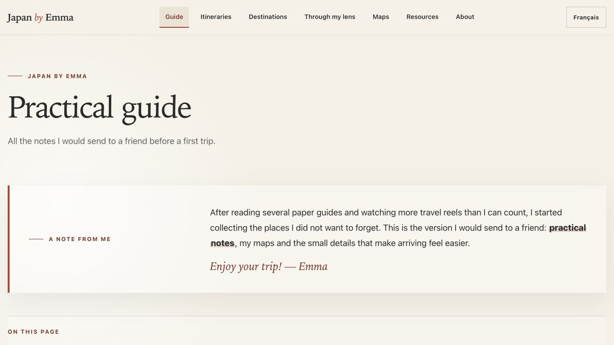
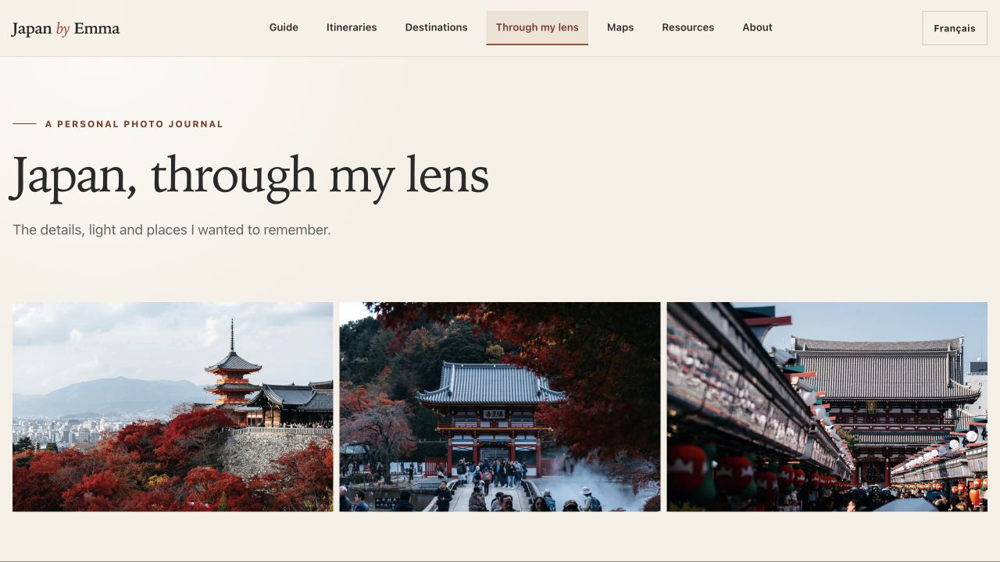

# Japan by Emma

A personal, bilingual travel guide to Japan, created from the places, photographs and practical tips I have collected along the way.

**[Visit Japan by Emma](https://emmavellard.github.io/japan-by-emma/)**

## A personal guide to Japan

I fell completely in love with Japan—its everyday details, its food and landscapes, and the way each neighbourhood seems to have a world of its own. I created this guide to gather the places and tips I’ve collected along the way and share them with friends and fellow travellers.

This is not meant to be an exhaustive travel website. It is a personal journal made to help you prepare for a trip, discover places I loved and enjoy a little of Japan through my eyes.

## What you’ll find

- Practical notes for planning and travelling
- Ready-to-use itineraries
- Personal destination guides
- Maps and useful travel resources
- Restaurant, hotel and experience recommendations
- A photo journal: _Japan, through my lens_
- The complete guide in English and French

## A look inside

### Practical notes for your trip

The guide brings together the advice I would send to a friend before a first trip, from transport and language to reservations and everyday customs.

### Japan, through my lens

A growing collection of photographs from my travels, focused on the details, light and places I wanted to remember.

## Choose your language

- [Read the guide in English](https://emmavellard.github.io/japan-by-emma/en/)
- [Lire le guide en français](https://emmavellard.github.io/japan-by-emma/fr/)

## A living travel journal

The guide will continue to grow as I revisit Japan, discover new places and add more photographs. Practical information can change, so it is always worth checking official sources before travelling.

Made with love for Japan by Emma. You can also visit my [personal website](https://www.emmavellard.com/).
